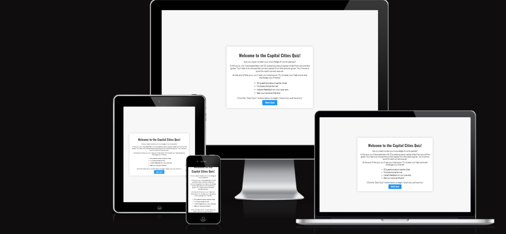
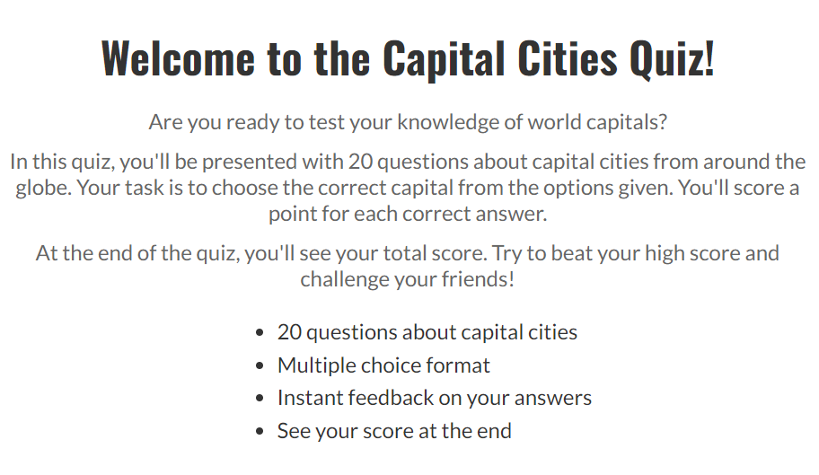
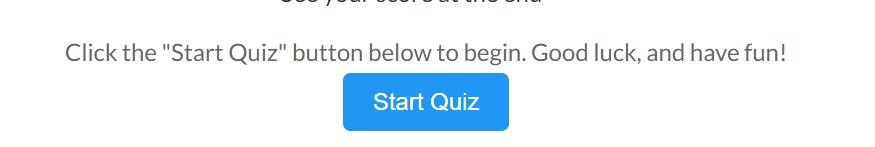
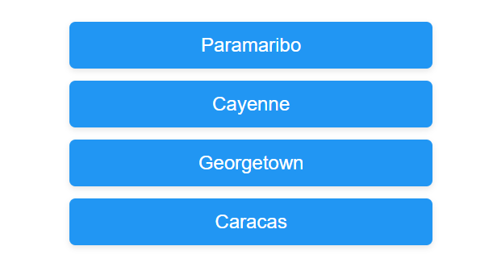
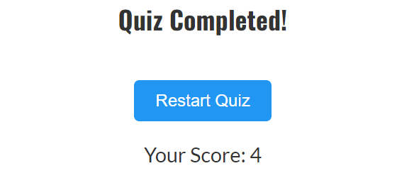
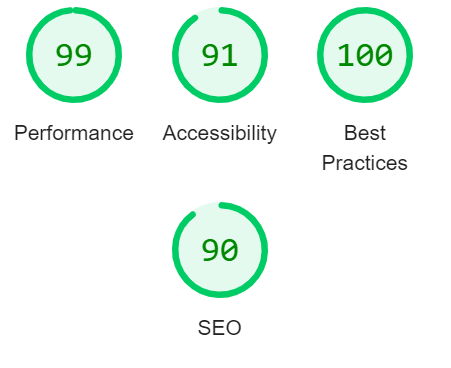

# Capital Cities Quiz

[Capital Cities Quiz](https://your-username.github.io/capital-cities-quiz/) is an interactive quiz game where users test their knowledge of world capitals. Players answer questions about the capital cities of different countries, and their scores are tracked throughout the game. This educational game is suitable for anyone interested in geography and aims to provide a fun way to learn.

## Technologies Used

- HTML
- CSS
- JavaScript
- Google Fonts

## Features

### Existing Features

- **Title and Introduction**

  - The title of the quiz is prominently displayed on the start screen, welcoming users to the game.
  - The introduction provides clear instructions on how to play and what to expect from the quiz.

  

- **Start Screen**

  - The start screen offers an explanation of the game's rules and objectives.
  - Players can read about the scoring system and start the quiz by clicking the "Start Quiz" button.

  

- **Question Display**

  - Each question about capital cities is displayed one at a time.
  - Players can choose the correct answer from four options.
  - Questions are randomly selected to ensure a unique experience each time the quiz is played.

  

- **Score Display**

  - The score is updated and shown after each question is answered.
  - Players can track their progress throughout the quiz.
  - The final score is displayed at the end of the quiz.

  

- **Interactive Options**

  - Answer options are presented as clickable buttons.
  - Correct and incorrect answers are highlighted in different colors for clarity.
  - Players can see immediate feedback after each question is answered.

  

- **Restart Option**

  - After completing the quiz, players can restart the quiz to play again.
  - The quiz resets with a new set of random questions for replayability.

  

### Features Left to Implement

- A feature to allow players to select the number of questions they want to answer.
- Adding a timer to increase the challenge and encourage quick thinking.
- Including hints for more challenging questions.

## Testing

- Tested across different browsers including Chrome, Firefox, and Edge to ensure compatibility.
- Responsive design was confirmed by testing on various screen sizes to ensure all elements are accessible and functional.
- All interactive elements were tested for functionality and responsiveness.
- Feedback from users helped identify and fix any remaining issues.

### Validator Testing

- **HTML**

  - Passed through the official W3C validator with no errors.
  - Minor warnings regarding best practices were addressed where applicable.

- **CSS**

  - Passed through the official W3C (Jigsaw) validator with no errors or warnings.

- **Accessibility and Performance**

  - Using Lighthouse in DevTools, the site was confirmed to be performant and accessible.
  - The chosen colors and fonts provide good readability and contrast.

  

### Bugs

- **Solved Bugs**

  - A bug was encountered where the score was not updating correctly; this was resolved by correcting the logic in the JavaScript code.
  - Alignment issues with the options were fixed by adjusting the CSS styling.

- **Unsolved Bugs**

  - None.

## Deployment

- The site was deployed to GitHub Pages. The steps to deploy are as follows:
  - In the GitHub repository, navigate to the Settings tab.
  - From the "Pages" section, select the branch to deploy (usually `main` or `master`).
  - After selecting the branch, the site is automatically published.

The live link can be found here - [Capital Cities Quiz](https://your-username.github.io/capital-cities-quiz/)

## Credits

### Content

- The game logic and content were developed using resources from educational websites about geography.
- Fonts used were sourced from Google Fonts.

### Media

- Images and icons used in the game were obtained from free resources such as [PublicDomainPictures.net](https://www.publicdomainpictures.net/) and [Vecteezy.com](https://www.vecteezy.com/).
